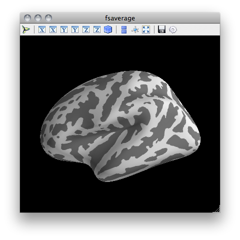

.. _command_line:

.. currentmodule:: surfer

The command-line interface
==========================

Introduction
------------

The command-line program ``pysurfer`` is designed to largely replicate
Freesufer's tksurfer command-line interface in the format and style
of arguments it accepts. Like tksurfer, invoking it will initialize
a visualization in an external window and begin an IPython session in the
terminal, through which the visualization can be manipulated.

Initializing a simple visualization session is quite easy. Simply call
``pysurfer`` with three positional arguments: the subject_id, the
hemisphere, and the surface geometry to visualize::

    pysurfer fsaverage lh inflated

which will open a viewing session that looks like this:

Manipulating the visualization
------------------------------

Once the viewer window is open, there are two ways to manipulate the
visualization. To see other angles, zoom in or out, and translate the
brain, simply click and drag with your mouse. See the `Mayavi documentation
<http://code.enthought.com/projects/mayavi/docs/development/html/mayavi/
application.html#mouse-interaction>`_ for more information about using the
mouse and keyboard to interact with a Mayavi scence.

When pysurfer finishes loading the visualization, it initializes an
IPython session in terminal, which allows for a more comprehensive
interaction with the scene. The IPython interactive namespace will
include a ``brain`` variable, which is bound to the :class:`Brain`
object underlying the visualization. For convenience, the ``b`` variable
is also mapped to this object. (As a reminder, you can always type
``whos`` in an IPython prompt to see the contents of the interactive
namespace.) See the :class:`Brain` documentation for full information
about how to control the visualization in this way.

Other command-line options
--------------------------

As in tksurfer, most aspects of the visualization can be initialized
from the command-line. To get a full documentation of the command-line
interface, simply type ``pysurfer`` at a terminal prompt and hit enter.
