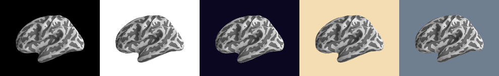
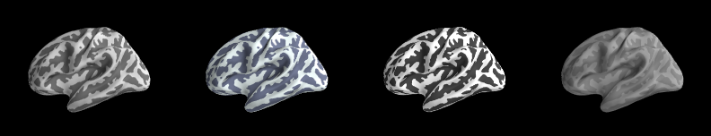

.. _custom_viz:

Customizing the Visualization
=============================

One advantage to PySurfer over Tksurfer is that you are not
limited to a single look for the visualization. Of course, being
built on Mayavi, PySurfer is in theory completely customizable.
However, we also offer a few preset options so that you do not
have to delve into the underlying engine to get a different look.

Changing the display background
-------------------------------

There are five preset options for the color of the visualization
background. They are ``black``, ``white``, ``charcoal``, ``midnight``,
``slate``, and ``sand``:

Changing the curvature color scheme
----------------------------------- 

By default, a new :class:`Brain` instance displays the binarized 
cortical curvature values, so you can see which patches of cortex
are gyri and which are sulci (pass ``curv=False`` to the
:class:`Brain` constructor, or use the ``-no-curv`` switch in the
command-line interface to turn this off). There are four preset
themes for the curvature color scheme: ``classic``, ``bone``,
``high_contrast``, and ``low_contrast``:

Note that, in each theme, the darker color signifies sulci.

Changing the display size
-------------------------

The default display window is 800px by 800px, but this is also
customizable. You may use any positive number for the size
(subject, possibly, to Mayavi/hardware limitations we are not
aware of). The viewing window is always square, so just give one
number and it will be used for both width and height.

How to use these themes
-----------------------

These options can be set in three places. The first is in your
config file. Set your preferred visualization theme there, and it
will be used automatically whenever you start PySurfer. You may
also override this theme for any individual visualization session.
If using the Python ``surfer`` library, you may pass a
``config_opts`` dictionary to the :class:`Brain` constructor,
which will override any values you have set in your config file.
If using the command-line interface, there are parameters for each
of the above options. Regardless of method, the key names are
``background``, ``cortex``, and ``size``.

For example:

.. sourcecode:: ipython
    
    In [1]: from surfer import Brain
    In [2]: b = Brain('fsaverage', 'lh', 'inflated', config_opts={'cortex':'bone'})

or::

    pysurfer fsaverage lh inflated -background slate -size 400

in your shell terminal.
